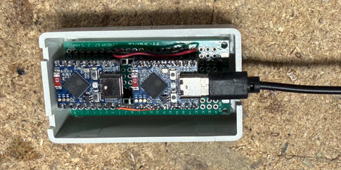

# UDP Broadcast Relay — using ESP32-S3-Zero

An ESP32 port of [udp-broadcast-relay-redux](https://github.com/udp-redux/udp-broadcast-relay-redux) (GPL-2.0) to an esp32 implementation.

Relays UDP broadcast traffic between two isolated WiFi networks using a pair of Waveshare ESP32-S3-Zero boards connected back-to-back via UART. The original relay logic — TTL-based loop prevention, gram[] buffer layout, per-interface forwarding, and broadcast address rewriting — is preserved without modification.



---

## My specific Use case

HDHomeRun tuners and similar devices use UDP broadcast for discovery on the local subnet. When the tuner lives on a separate IoT network, discovery packets never reach the LAN. This relay bridges the two networks transparently at the packet level without routing or VPN infrastructure.

---

## Hardware

| Item | Detail |
|------|--------|
| Board | Waveshare ESP32-S3-Zero (x2) |
| SoC | ESP32-S3FH4R2 |
| Flash | 4 MB QIO |
| PSRAM | 2 MB QSPI |
| LED | WS2812B on GPIO21 (NEO_RGB order) |
| UART link | GPIO13 = TX, GPIO12 = RX, 921600 baud |

Wire the two boards with TX crossed to RX:

```
node_lan  GPIO13 (TX) ──────── GPIO12 (RX)  node_iot
node_lan  GPIO12 (RX) ──────── GPIO13 (TX)  node_iot
node_lan  GND         ──────── GND          node_iot
```

---

## System architecture

```
  [ LAN network ]                          [ IoT network ]
  192.168.1.x/24                           192.168.10.x/24
       │                                         │
  ┌────┴────────────────┐      UART       ┌───────┴───────────────┐
  │     node_lan        │◄───921600───────►│     node_iot          │
  │  ESP32-S3-Zero      │  GPIO13↔GPIO12  │  ESP32-S3-Zero        │
  │                     │                 │                        │
  │  WiFi: LAN SSID     │                 │  WiFi: IoT SSID        │
  │  SOCK_RAW recv      │                 │  SOCK_RAW recv         │
  │  lwIP raw_pcb send  │                 │  lwIP raw_pcb send     │
  └────────────────────┘                 └────────────────────────┘
```

Each board:
1. Joins its WiFi network and opens a `SOCK_RAW IPPROTO_UDP` socket to receive all UDP traffic
2. Filters for packets destined to `RELAY_PORT` (default 65001)
3. Applies TTL-based loop prevention — packets whose TTL matches `RELAY_ID + 64` originated from the relay and are dropped
4. Forwards qualifying packets to the other interface: either WiFi (via lwIP raw_pcb) or UART (via the framed serial link)
5. Rewrites the destination address to the broadcast address of the outgoing interface

The UART link carries the same `gram[]` wire format as the original program's internal buffer — a raw IP+UDP header followed by the payload — wrapped in a lightweight framing layer.

---

## UART framing protocol

The inter-board link uses a simple framed protocol over Serial2:

```
[0xAA][0x55][len_lo][len_hi][gram_data...][crc16_lo][crc16_hi]
```

- Sync bytes `0xAA 0x55` delimit frame boundaries
- `len` is the number of data bytes (little-endian uint16)
- CRC-16/CCITT-FALSE (poly=0x1021, init=0xFFFF) covers the length and data fields
- The receiver uses a state machine and discards frames with bad CRC

The UART framing interface (`iface_uart.h`) is treated as a stable wire contract between boards. Changes to it require reflashing both nodes. Changes to relay logic (`relay.cpp`) only require reflashing the affected node.

---

## LED status

| Color | Meaning |
|-------|---------|
| Red | Connecting to WiFi |
| Yellow | WiFi connected; waiting for UART link peer |
| Green | Fully operational |

---

## Configuration

Copy `include/node_config.h.template` to `include/node_config.h` and fill in WiFi credentials:

```cpp
#if defined(NODE_LAN)
#  define WIFI_SSID  "your-lan-ssid"
#  define WIFI_PASS  "your-lan-password"
#elif defined(NODE_IOT)
#  define WIFI_SSID  "your-iot-ssid"
#  define WIFI_PASS  "your-iot-password"
#endif
```

`node_config.h` is gitignored and never committed.

Shared settings are in `include/config.h`:

| Define | Default | Description |
|--------|---------|-------------|
| `RELAY_ID` | 1 | Instance ID (1–99); sets outgoing TTL to `RELAY_ID + 64` |
| `RELAY_PORT` | 65001 | UDP port to relay |
| `LINK_BAUD` | 921600 | UART baud rate |
| `LINK_RX_PIN` | 12 | UART RX GPIO |
| `LINK_TX_PIN` | 13 | UART TX GPIO |
| `STATUS_INTERVAL_MS` | 15000 | Periodic status print interval |

---

## Mapping original command-line arguments

The original program is configured entirely via command-line arguments at runtime. This port replaces them with compile-time `#define` values in two header files.

| Original argument | Example | Maps to | File |
|-------------------|---------|---------|------|
| `--id <n>` | `--id 1` | `#define RELAY_ID 1` | `include/config.h` |
| `--port <port>` | `--port 65001` | `#define RELAY_PORT 65001` | `include/config.h` |
| `--dev <iface>` (first) | `--dev eth0` | `WIFI_SSID` / `WIFI_PASS` under `NODE_LAN` | `include/node_config.h` |
| `--dev <iface>` (second) | `--dev wlan1` | `WIFI_SSID` / `WIFI_PASS` under `NODE_IOT` | `include/node_config.h` |
| `-f` (fork/daemonize) | `-f` | Not applicable — no OS process model | — |
| `-s <src_ip>` (source override) | `-s 192.168.1.1` | Not supported — source IP is always the original sender's | — |

### Notes

**`--id`** must be unique per relay pair on a network. If you run multiple relay pairs simultaneously (e.g. relaying two different ports), give each pair a different `RELAY_ID` and rebuild both nodes. The ID sets the outgoing TTL (`RELAY_ID + 64`), which is how the relay detects and drops its own reflected packets.

**`--port`** in the original can be specified multiple times to relay several ports at once. This port relays a single port. To relay additional ports, `RELAY_PORT` would need to become a list and the filter in `poll_wifi()` updated accordingly.

**`--dev`** in the original takes Linux interface names (`eth0`, `wlan0`, etc.) and can accept more than two. Here the two interfaces are fixed: the board's WiFi connection and the UART link to the peer board. The WiFi interface is configured implicitly by the credentials in `node_config.h`; the UART link is always present.

---

## Building and flashing

```bash
# Flash the LAN node
pio run -e node_lan -t upload

# Flash the IoT node
pio run -e node_iot -t upload

# Monitor LAN node
pio device monitor -e node_lan

# Flash and monitor in one step
pio run -e node_lan -t upload -t monitor
```

---

## Adaptations from the original

The original program runs on Linux and uses standard POSIX socket APIs. ESP32's lwIP stack does not support several of those APIs, requiring the following changes:

### Receive path
The original uses `SOCK_RAW` with `IP_HDRINCL` and `IP_RECVTTL` (via `recvmsg` ancillary data) to read the TTL of incoming packets.

`IP_HDRINCL` and `IP_RECVTTL` are not implemented in ESP-IDF's lwIP. The fix: use `SOCK_RAW IPPROTO_UDP`, which delivers the full IP packet — header included — directly into the receive buffer. TTL is then read from `gram[8]` without needing any ancillary data mechanism.

### Send path
The original uses `SOCK_RAW` with `IP_HDRINCL` to send packets with a spoofed source IP and a controlled TTL.

This is also unsupported. The fix: use the lwIP `raw_pcb` API (`raw_new` / `raw_sendto_if_src`), which allows setting both the source address and TTL directly. The `raw_setttl()` macro is absent from the ESP-IDF lwIP headers but is defined as the single assignment `pcb->ttl = ttl`, so `pcb->ttl = s_ttl` is used directly.

### Loop prevention on UART
The original runs on a single host with multiple network interfaces and applies TTL echo detection to all received packets. On the ESP32 pair, the UART is a private point-to-point link — packets on it were already received from one side's WiFi and are destined for the other side's WiFi. Applying the WiFi TTL check to UART-received frames would incorrectly drop all traffic when both nodes share the same `RELAY_ID`. The TTL check is applied only to WiFi-received packets; the UART path forwards unconditionally.

### UART link test during rolling restarts
When one board reboots (e.g. after a reflash) while the other is already running, the running board is past its init sequence and will not call `relay_uart_test()` again. The rebooting board's link test would time out with no response. The fix: `poll_uart()` detects probe frames (identified by `TTL == 0xFF` and no payload) and echoes them back immediately, allowing the rebooting board's link test to succeed regardless of which board rebooted first.

---

## File structure

```
udp-relay2/
├── include/
│   ├── config.h              # Shared constants (port, GPIO, timing)
│   ├── node_config.h         # WiFi credentials — gitignored, not committed
│   └── node_config.h.template
├── src/
│   ├── main.cpp              # Arduino setup/loop, LED control, status printing
│   ├── relay.h               # Public relay API
│   ├── relay.cpp             # Core relay logic (port of original main.c)
│   ├── iface_uart.h          # UART framing interface (stable — changing requires both nodes reflashed)
│   └── iface_uart.cpp        # UART framing implementation
└── platformio.ini            # Two build environments: node_lan, node_iot
```

---

## License

Relay logic ported from [udp-broadcast-relay-redux](https://github.com/udp-redux/udp-broadcast-relay-redux), which is licensed under GPL-2.0. This project is likewise GPL-2.0.
